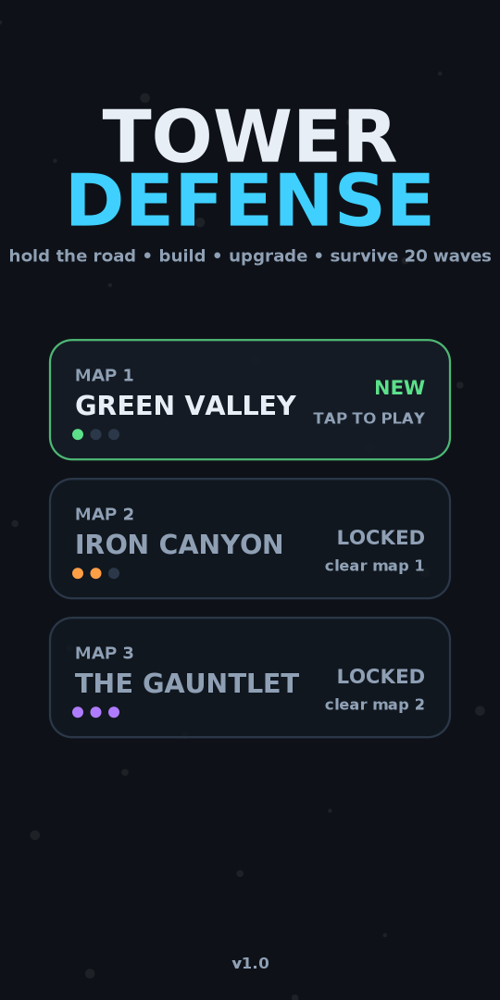
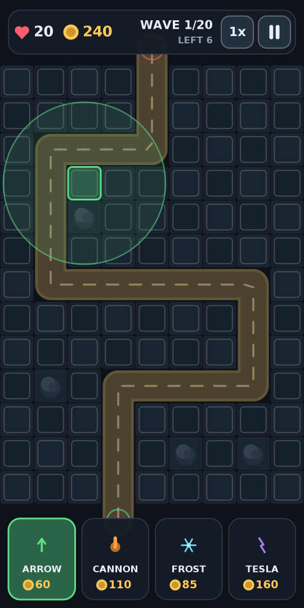
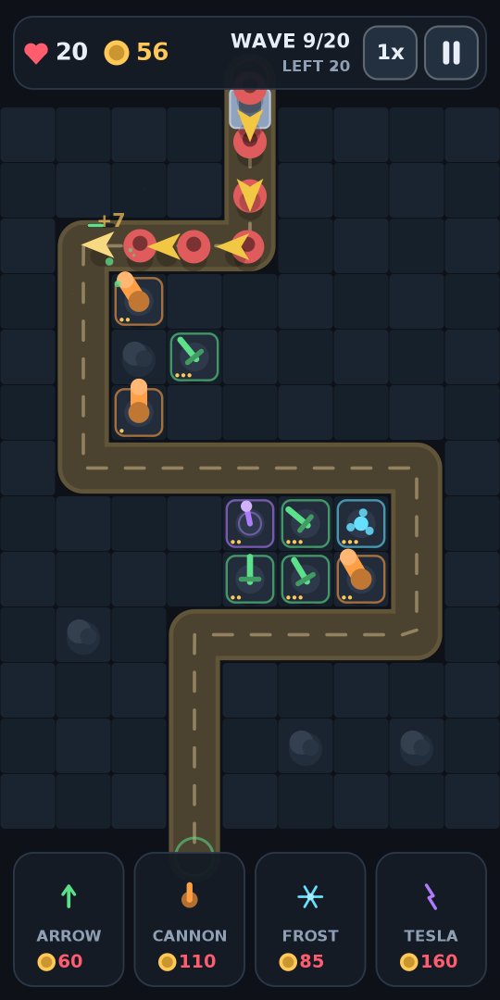
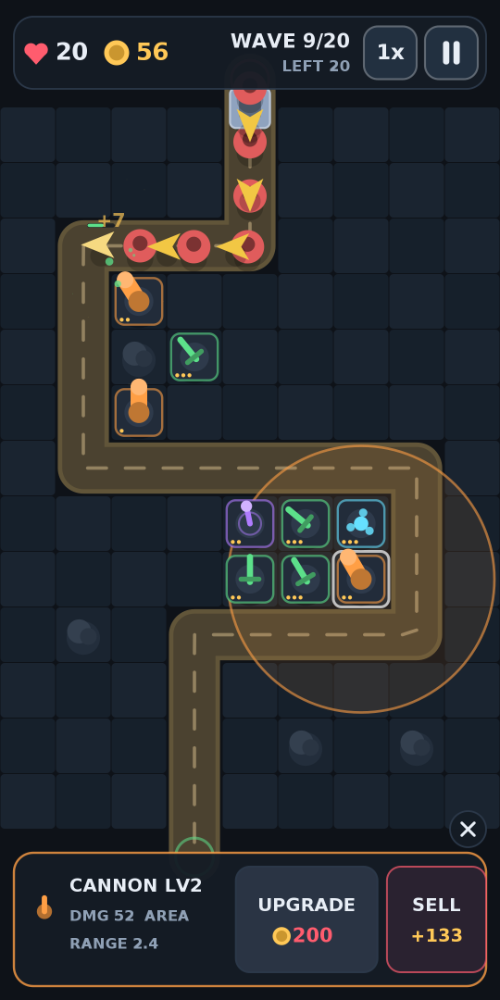

# Tower Defense

A complete, offline Android tower-defense game. Everything is drawn procedurally
on a `SurfaceView` canvas — no engine, no third-party libraries, no assets, no
network, no permissions. The whole APK is 68 KB.

**Download:** [`dist/TowerDefense.apk`](dist/TowerDefense.apk)

| Menu | Building | Battle | Upgrading |
|---|---|---|---|
|  |  |  |  |

## Install

1. Copy `dist/TowerDefense.apk` to the phone.
2. Open it with the file manager and allow *install from unknown sources* when
   prompted (Android blocks sideloading by default).

Requires Android 5.0 (API 21) or newer. Signed with a locally generated debug
key using v1 + v2 + v3 signature schemes, so it installs on current Android
versions.

## The game

Creeps walk a fixed road from the entrance to the exit. Every one that gets
through costs lives; at zero lives the run ends. Survive 20 waves to clear a
map.

**Three maps**, unlocked in order, each longer and harder than the last:
Green Valley → Iron Canyon → The Gauntlet. Best wave reached is saved per map.

**Four towers**, three levels each:

| Tower | Cost | Behaviour |
|---|---:|---|
| Arrow | 60 | Fast single-target shots, longest range |
| Cannon | 110 | Slow, heavy splash damage |
| Frost | 85 | Little damage, chills creeps in a small area |
| Tesla | 160 | Lightning that chains between nearby creeps |

**Five creep types:** grunts, fast runners, armoured tanks, splitters that break
into two smaller creeps when killed, and a boss on waves 10 and 20.

**Controls:** tap a tower in the bottom bar, then tap a free tile to build. Tap
a placed tower to see its range and the upgrade / sell panel. `1x/2x/3x` changes
game speed, and calling a wave early pays a gold bonus. Back button pauses.

## Building

The usual way to build this would be Android Studio, but the Google SDK
endpoints (`dl.google.com`) are unreachable from this environment, so the build
uses the Android tools packaged by Debian/Ubuntu instead:

```sh
sudo apt-get install -y aapt dalvik-exchange apksigner zipalign \
                        android-sdk-platform-23 openjdk-21-jdk-headless
./build.sh          # -> dist/TowerDefense.apk
```

`build.sh` compiles with `javac`, dexes with `dalvik-exchange`, packages
resources with `aapt`, aligns with `zipalign` and signs with `apksigner`,
generating a debug keystore on first run. Override `ANDROID_JAR`, `AAPT`,
`DEXER`, `ZIPALIGN` or `APKSIGNER` to point at a real Android SDK instead.

Because resources are compiled against the API 23 framework table, manifest
attributes newer than API 23 cannot be used — the code itself only calls APIs
that exist in 21, plus one API 23 call guarded at runtime
(`Surface.lockHardwareCanvas()`, which keeps the render loop on the GPU).

## Testing without a device

`tools/harness/` compiles the game against ~200 lines of stub Android graphics
classes and runs it on the JVM. Two entry points:

```sh
./tools/harness/run.sh     # plays all three maps with a bot, ~35k frames
./tools/harness/shots.sh   # renders real frames to build/shots/*.png via Java2D
```

The play-through checks that nothing crashes and that no draw call ever
receives a NaN or infinite coordinate, and prints where lives were lost so the
difficulty curve can be tuned:

```
map 0 GREEN VALLEY   VICTORY  wave 20/20  lives 20  gold 2367  towers 16
map 1 IRON CANYON    VICTORY  wave 20/20  lives 18  gold 2347  towers 16
map 2 THE GAUNTLET   VICTORY  wave 20/20  lives  3  gold 2017  towers 16
        leaks: w11:-6 w20:-6
```

The screenshots in this README come from `shots.sh` — they are the game's own
drawing code rendered through Java2D, not mockups.

## Layout

```
app/src/main/
  AndroidManifest.xml
  java/com/claude/td/
    MainActivity.java   activity, fullscreen, lifecycle
    GameView.java       SurfaceView + render thread + touch dispatch
    Game.java           state machine, waves, economy, damage
    Level.java          road geometry, buildable grid, map drawing
    Tower.java          stats, targeting, firing, turret art
    Enemy.java          creep stats, movement, creep art
    Projectile.java     shots, splash, slow application
    Fx.java             particles, rings, beams, floating labels
    Hud.java            bars, panels, overlays and their hit testing
    Ui.java             palette, shared paints, drawing helpers
    Save.java           SharedPreferences progress
  res/                  launcher icons and the app name
build.sh                APK build
tools/make_icons.py     generates the launcher icons from code (no image libs)
tools/harness/          headless test + screenshot renderer
```

## Known limitation

There is no Android device or emulator in this environment (emulator system
images also come from `dl.google.com`), so the APK has not been launched on real
hardware. It is verified as far as it can be here: the package installs-ready
structure is checked with `aapt dump badging`, signatures verify under v1/v2/v3,
and the complete game and UI code — simulation, layout and every draw call —
runs headlessly on the JVM through the harness above.
