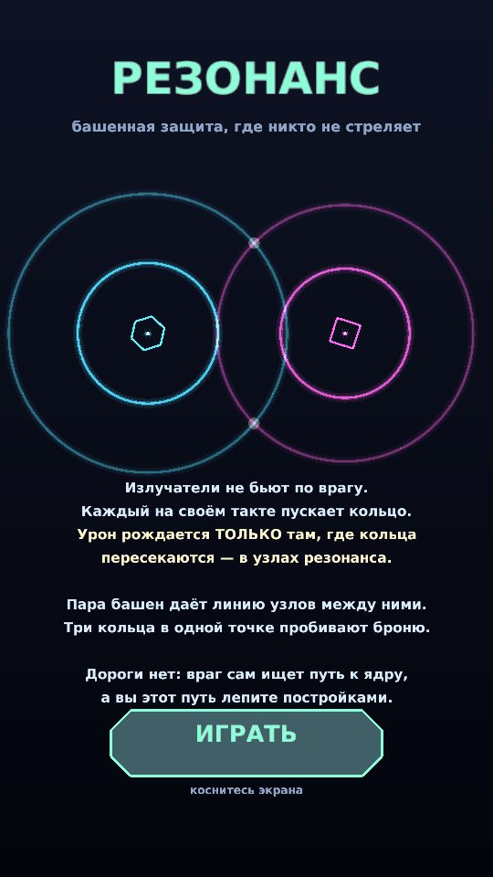
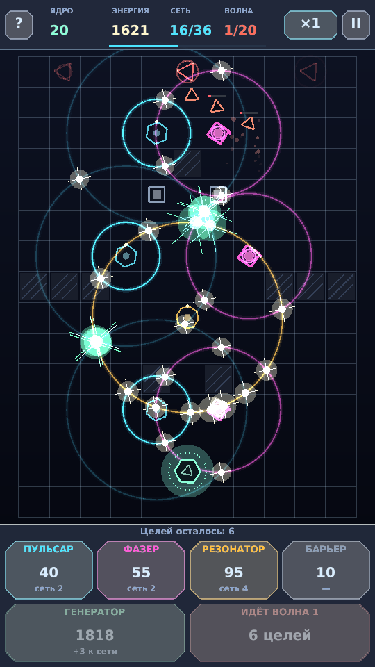
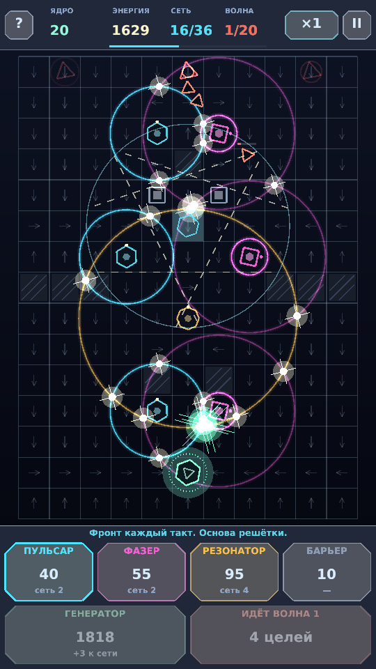

# РЕЗОНАНС — tower defense, где башни не стреляют

Мобильная башенная защита на **libGDX** (Java, OpenGL ES), собранная в APK.
Не HTML, не движок-конструктор — обычный нативный Android-проект.

**Готовый APK: [`dist/resonance-td.apk`](dist/resonance-td.apk)** (1.4 МБ, Android 5.0+, arm/x86)

```
adb install -r dist/resonance-td.apk
```
…либо скачать файл на телефон и открыть (нужно разрешить установку из неизвестных источников).

<p align="center">
  
  
  
</p>

---

## Чем она не как все

В обычном TD башня выбирает цель и стреляет. Здесь **ни одна башня не наносит урона**.

1. **Урон живёт в геометрии.** Каждый излучатель на своём такте выпускает
   расширяющееся кольцо. Кольцо само по себе безвредно. Урон возникает
   **только в точках пересечения колец разных башен** — в «узлах резонанса».
   Узлы стремительно разбегаются по полю, и попадать под них должны враги.

2. **Пара башен = линия огня.** Точки пересечения двух колец всегда лежат на
   серединном перпендикуляре к отрезку между башнями. То есть каждая пара
   создаёт **линию**, вдоль которой бегут узлы. Смысл игры — уложить эти линии
   ВДОЛЬ вражеского коридора, а не поперёк. Ставить башни «покучнее у ядра»
   не работает: в симуляции такая стратегия сливает на 3-й волне.

3. **Фаза как оружие.** У излучателя есть фаза: он бьёт «на такт» или
   «через полтакта». Переключение фазы (15 энергии) сдвигает всю картину
   пересечений — это дешёвая перенастройка обороны без перестройки.

4. **Гармоники.** Если в одной точке сходятся три кольца, узел становится
   зелёным и получает множитель урона. Только такой узел **пробивает броню**
   «Панциря» — против него нужна не масса башен, а точная геометрия.

5. **Дороги нет.** Враг не идёт по нарисованной тропинке: он течёт по волновому
   полю к ядру, огибая ваши постройки. Маршрут лепите вы сами (в том числе
   дешёвыми барьерами), и перекрыть путь совсем игра не даст.

6. **Мощность сети.** Башни ограничены не только деньгами, но и мощностью.
   Она растёт с волнами и покупкой генераторов — поэтому «застроить всё поле»
   невозможно в принципе, каждая клетка — выбор.

7. **Звук синтезируется в реальном времени.** В APK нет ни одного аудиофайла:
   бит, хэты и «пентатонные» отклики резонанса считаются семплами на лету
   тем же метрономом, что гоняет башни.

### Что в игре есть

* 4 постройки: **Пульсар**, **Фазер** (сдвиг на полтакта), **Резонатор**
  (широкое кольцо раз в два такта), **Барьер** (не излучает, гнёт маршрут).
* 3 уровня улучшений, переключение фазы, продажа.
* 6 типов врагов: Дрон, Стриж, Панцирь (броня), Рой (делится на Искры),
  Искра, Фантом (уязвим через такт).
* 20 волн, три портала, ускорение ×1/×2/×3, пауза, справка по механике.
* Вся графика векторная (ShapeRenderer), без спрайтов.

### Управление

* Тап по кнопке постройки → **проведите пальцем по полю и отпустите** там, где
  ставить. Пока палец на поле, видно призрак башни, её радиус и пунктиром —
  будущие линии резонанса с соседями.
* Тап по стоящей башне — панель «Улучшить / Фаза / Продать».
* «ВОЛНА» запускает следующую волну досрочно и доплачивает за каждую
  сэкономленную секунду.

---

## Сборка

Особенность: **сборка не требует ни Android Studio, ни Android SDK, ни Gradle.**
`build.sh` сам достаёт всё необходимое и делает APK «руками»:

```
javac  →  dx (dex)  →  aapt2 (ресурсы + манифест)  →  zip  →  jarsigner
```

```bash
./build.sh            # обычная сборка, результат в dist/
./build.sh clean      # с нуля
```

Откуда берутся инструменты (всё кладётся в `.toolchain/`, в git не попадает):

| что | откуда |
|---|---|
| libGDX 1.13.1 + нативные `.so` под 4 ABI | Maven Central |
| `android.jar` (API 28) | зеркало `Sable/android-platforms` |
| `dx` (дексер, AOSP 14) | Maven Central, `com.jakewharton.android.repackaged:dalvik-dx` |
| `aapt2` (linux x86_64) | prebuilt внутри релиза Apktool |
| подпись | `jarsigner` из JDK, отладочный keystore генерируется сам |

Подпись — схема v1 при `targetSdk 28`, чего достаточно для установки на любой
версии Android. Для публикации в Play нужен свой ключ и v2/v3-подпись.

Требования к машине сборки: JDK 8+ (проверено на 21), Python 3, `curl`, `unzip`.

### Ресурсы генерируются кодом

* `tools/make_icons.py` — рисует иконку (два пересекающихся кольца) своим
  PNG-энкодером на `zlib`, без Pillow.
* `tools/FontGen.java` — печёт растровый шрифт с кириллицей (AngelCode `.fnt`
  + атлас) из системного DejaVu Sans через AWT.

## Разработка и отладка баланса

```bash
./tools/run_desktop.sh          # запуск на десктопе (LWJGL3)
./tools/simtest.sh              # прогон 20 волн без графики + карта урона
```

`tools/SimTest.java` играет за бота двумя стратегиями (осмысленные пары башен
и наивная застройка вокруг ядра) и печатает по волнам энергию, прочность,
убитых, утечки и загрузку сети. `tools/MicroTest.java` расставляет сетку
неподвижных «манекенов» и рисует ASCII-карту урона — на ней прямо видно ту
самую линию резонанса между парой башен.

```
== ПУЛЬСАР(4,8) + ФАЗЕР(7,8) ==
                ::++    ++::
                  @@....%%
                  %%++++##
              ::  ++====++  ::
              **##::::::::##**
```

## Структура

```
core/src/com/resonance/td/     логика и рендер (без Android-зависимостей)
  World.java                   вся симуляция: такты, кольца, узлы, враги
  Grid.java                    волновой алгоритм от ядра (поле направлений)
  Renderer.java  Hud.java      векторная отрисовка и интерфейс
  Sfx.java                     синтез звука в отдельном потоке
  Config.java                  весь баланс одним файлом
android/                       манифест, ресурсы, точка входа
desktop/                       запуск на ПК + служебный снимок экранов
tools/                         сборка, генераторы ресурсов, тесты баланса
```
